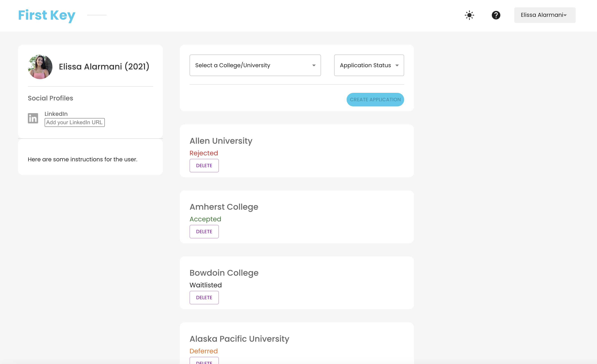
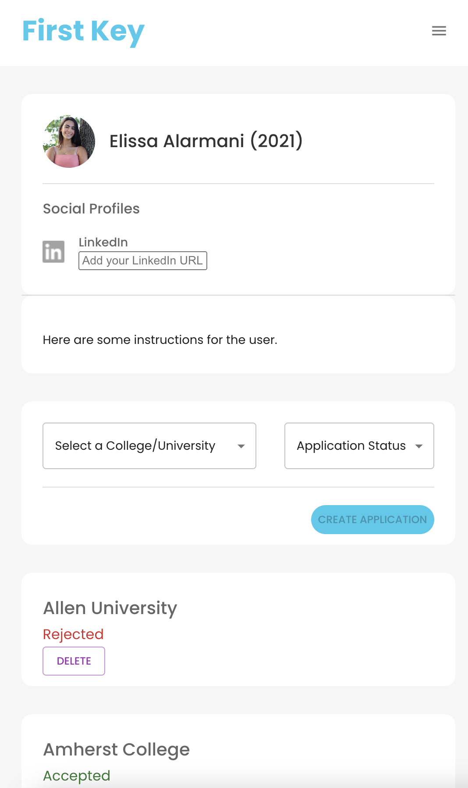

# First Key

:warning: FIRST KEY IS LIVE ACCESS HERE: https://first-key.netlify.app/ :warning:

First Key is a web application designed for first generation high school students applying to college. Currently the application supports adding and deleting college applications, alongside with user registration, authentication, and saving user data. Additionally, there is dark mode and light mode, and mobile compatability. Working on the ability to edit college applications, provide more information about each college, and move from MongoDB to a SQL Databse.

Current Desktop View:

Current Mobile View:

